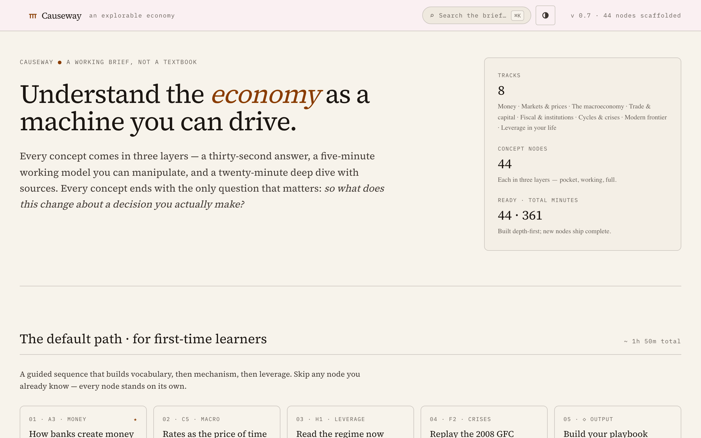
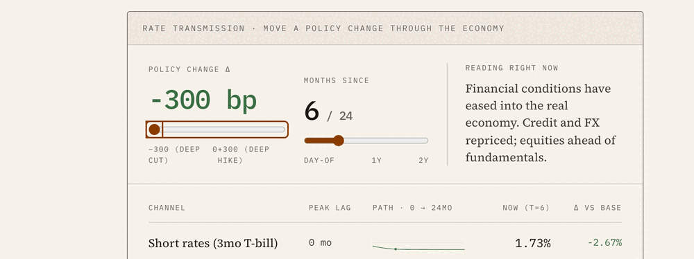
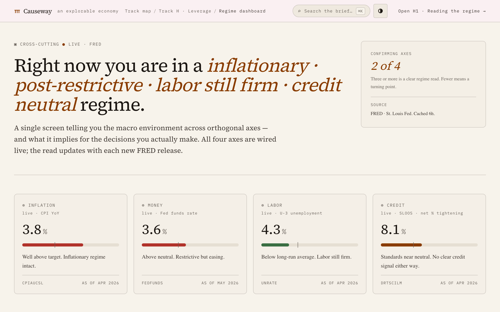
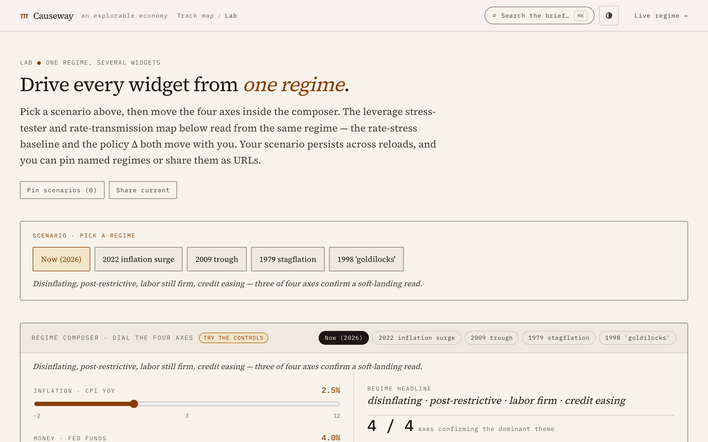

# Causeway

> An explorable economy. Understand the economy as a machine you can drive.

[](https://www.causewayecon.org/)
[](https://github.com/RealMaxPower/causeway/actions/workflows/ci.yml)
[](https://nextjs.org/)
[](LICENSE)
[](https://docs.github.com/en/authentication/managing-commit-signature-verification)

Causeway is an interactive learning environment for global economics. Every concept comes in three layers — a thirty-second pocket answer, a five-minute working model you can manipulate, and a twenty-minute deep dive with sources. Every concept ends with the only question that matters: *so what does this change about a decision you actually make?*

It's for the economically curious non-economist — anyone who reads the news and wants the machine behind the headlines, taught through models you drive rather than diagrams you read.

**Try it live → [causewayecon.org](https://www.causewayecon.org/)**

**Status:** v0.7 — 44 concept nodes shipped, lab mode with shareable scenarios, FRED-backed regime dashboard.

[](https://www.causewayecon.org/)

---

## The three-layer scaffold

- **L1 — Pocket** (~30 s). One sentence answer to "what is this?", one sentence on "why care?", one animated visual.
- **L2 — Working model** (~5 min). An interactive widget the user manipulates, interleaved with short prose and a "what this means for you" callout.
- **L3 — Full picture** (~25 min). Historical context, debates, primary sources, optional math.

A user must be able to stop at any layer without feeling pushed. Each layer is complete on its own.



*L2 in action: move one policy rate and watch the change ripple through Treasuries, mortgages, credit spreads, and equities — each on its own lag. ([static version](docs/screenshots/l2-working-model.png).)*

## The eight tracks

| | Track | Scope |
|--|--|--|
| **A** | Money | What money is, who issues it, how banks create it, what gives it value |
| **B** | Markets | Prices as coordination, market structures, where markets fail |
| **C** | Macro | GDP, the cycle, unemployment, inflation regimes, rates as the price of time |
| **D** | Trade | Comparative advantage, balance of payments, supply chains, capital flows |
| **E** | Institutions | Central banks, IMF/BIS/WTO, reserve currencies, sanctions architecture |
| **F** | Crises | Anatomy of a financial crisis, replayable case studies, debt cycles |
| **G** | Frontier | Globalization, energy transition, demographics, AI, crypto |
| **H** | Leverage | Using all of the above in your life — the differentiator |

44 concept nodes total. See [docs/brief.md](docs/brief.md) for the full design.

## Beyond the nodes — turning understanding into decisions

| Regime dashboard (`/regime`) | Lab mode (`/lab`) |
|--|--|
| [](https://www.causewayecon.org/regime) | [](https://www.causewayecon.org/lab) |
| One screen reading the macro environment across four orthogonal axes, wired live to [FRED](https://fred.stlouisfed.org/). | Pin a scenario, dial four axes, and drive every widget from the same shared regime — then share it as a URL. |

---

## Quickstart

```bash
pnpm install
cp .env.example .env.local   # optional — see below
pnpm dev
```

Open <http://localhost:3000>.

The app runs fully without any keys — all 44 nodes, widgets, lab, and the FRED-backed `/regime` dashboard work out of the box. Two env vars are optional: `ANTHROPIC_API_KEY` enables the in-app AI tutor, and a `FRED_API_KEY` raises the rate limit on live regime data (it falls back to cached values without one).

## Stack

- **Frontend:** Next.js 16 App Router · React 19 · TypeScript · Tailwind CSS v4 · shadcn/ui
- **Content:** MDX, one file per concept node
- **Widgets:** Client components · Motion · D3 · Visx
- **AI tutor:** Anthropic SDK (Claude Haiku 4.5) via `/api/tutor` route handler with rate limiting (Upstash Redis) + daily-budget kill switch
- **Live data:** FRED (server-side fetch on `/regime`, cached 6h); the wider source registry cites BIS / IMF / OECD / BLS / BEA / NBER / etc. via canonical URLs in `lib/sources.ts`
- **Testing:** Vitest · Playwright

## Repo layout

```
app/              Next.js routes (home, /tracks/[t], /nodes/[id], /lab, /regime,
                  /playbook, /about, /license, /api/tutor)
components/
  chrome/         Topbar, SideNav, Hero, LayerSwitch, PrevNext
  layers/         L1, L2, L3 scaffold + Callout, Debate, Sources, Cite, Check
  widgets/        31 bespoke widgets, one folder each
  lab/            Lab-mode pieces (scenarios drawer, URL ingest, regime UI)
  providers/      RegimeProvider — shared context across lab readers
  tutor/          Tutor FAB and panel
  ui/             shadcn primitives
content/nodes/    MDX, one file per concept node (44)
lib/              tracks.ts, sources.ts (179 canonical citations),
                  regime-store, regime-scenarios, url-encoding, tutor/cost
scripts/          build-search-corpus.mjs, check-sources.mjs, check-internal-links.mjs
styles/           tokens.css (CSS variables consumed by Tailwind)
public/           Fonts, static brand assets (per-node OG images are generated
                  dynamically via app/nodes/[id]/opengraph-image.tsx)
docs/             brief.md, AUTHORING.md,
                  WIDGETS.md, ROADMAP.md, adr/, reviews/
tests/            Vitest unit + Playwright E2E
```

> Causeway began as a Babel-in-browser prototype, then was rebuilt on Next.js once the port reached parity. The prototype is not included in this repository.

## Documentation

- **[docs/AUTHORING.md](docs/AUTHORING.md)** — checklist for adding a new content node (MDX, tracks.ts, search corpus).
- **[docs/WIDGETS.md](docs/WIDGETS.md)** — checklist for adding a new interactive widget, including the three lab-mode opt-in patterns.
- **[docs/brief.md](docs/brief.md)** — the original product brief: intent, audience, pedagogy, success metrics. For current state, see the ROADMAP.
- **[docs/ROADMAP.md](docs/ROADMAP.md)** — what's queued for the next version.
- **[docs/adr/](docs/adr/)** — Architecture Decision Records.

## Contributing

Contributions are welcome — new or deeper nodes, new widgets, and citations especially. Good first contributions: fill out one node's L3 sources rail, or do a mobile-polish pass on a single widget. See **[CONTRIBUTING.md](CONTRIBUTING.md)** to get started, and **[CODE_OF_CONDUCT.md](CODE_OF_CONDUCT.md)** for community expectations. The [CHANGELOG](CHANGELOG.md) tracks what's shipped.

Before opening a PR: `pnpm lint && pnpm typecheck && pnpm test` (E2E: `pnpm e2e`).

## License

MIT — see [LICENSE](LICENSE).
